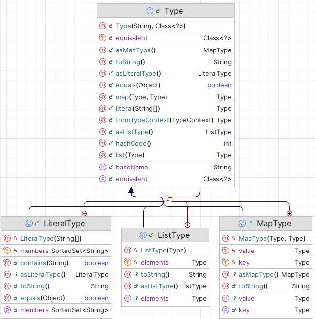
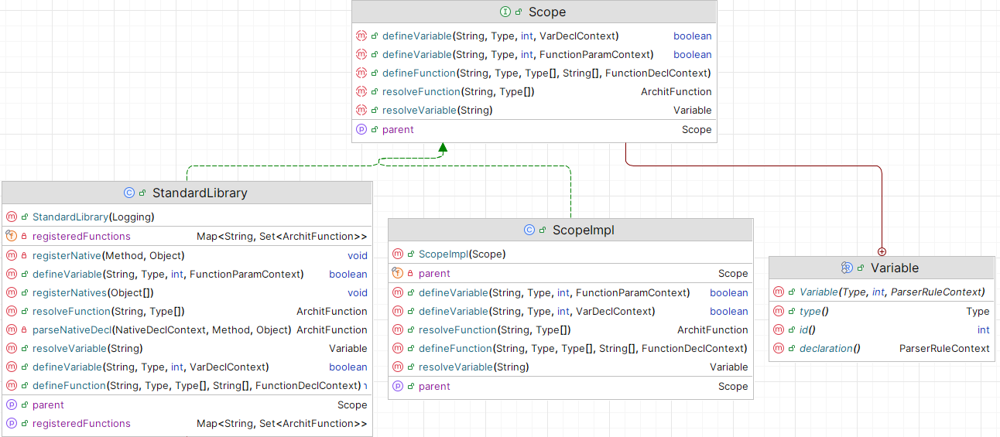
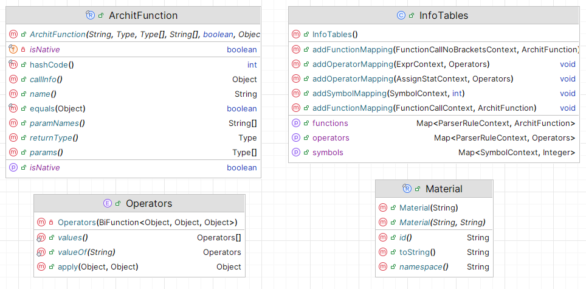

# archit
### Autorzy: Emil Wajda, Dawid Węcirz, Kacper Wojciuch

---
---

<br><br>

# Dokumentacja techniczna

## Wykorzystanie [Antlr4](https://www.antlr.org/)

Gramatyka języka została zdefiniowana w folderze [`src/main/antlr`](https://github.com/Kacper0510/archit/tree/master/src/main/antlr/archit/parser).

Jest to gramatyka podzielona, która składa się z osobnego leksera (`ArchitLexer.g4`) i parsera (`ArchitParser.g4`). Ten podział jest uzasadniony koniecznością wykorzystania wielu trybów leksera, które są używane specjalnie do interpolacji ciągów znaków zapisanych pomiędzy cudzysłowami.

Dla ułatwienia, przytaczamy całą gramatykę języka:

### `ArchitLexer.g4`
```antlr
lexer grammar ArchitLexer;

// Keywords and operators
LOGIC: 'true' | 'false';
TYPE: 'number' | 'real' | 'logic' | 'string' | 'material';
SPECIAL_ASSIGN: '+=' | '-=' | '*=' | '/=' | '^=' | '%=';
MINUS: '-';
PLUS: '+';
NOT: 'not';
COMPARE: '==' | '!=' | '<=' | '>=';
MULTIPLY_OPS: [*/%];
RETURN: 'return';
BREAK: 'break';
CONTINUE: 'continue';
VAR: 'var';
FUNCTION: 'function';
NATIVE: 'native';
IF: 'if';
ELSE: 'else';
AND: 'and';
OR: 'or';
WHILE: 'while';
REPEAT: 'repeat';

// Punctuation
SEMICOLON: ';';
COLON: ':';
COMMA: ',';
BRACE_OPEN: '(';
BRACE_CLOSE: ')';
SQUARE_OPEN: '[';
SQUARE_CLOSE: ']';
ANGLE_OPEN: '<';
ANGLE_CLOSE: '>';
CURLY_OPEN: '{' -> pushMode(DEFAULT_MODE);
CURLY_CLOSE: '}' -> popMode;
ARROW: '->';
MAP: '|';
ASSIGN: '=';
POWER: '^';
TAG: '#';
ENUM: '$';
PARENT: '~';

// Comments
COMMENT: '/*' .*? '*/' -> channel(HIDDEN);
LINE_COMMENT: '//' ~[\r\n]* -> channel(HIDDEN);

// Compound rules
STRING: '\'' (~['\\] | '\\\'' | '\\\\')* '\'';
NUMBER: [0-9]([0-9_]* [0-9])?;
REAL: [0-9]([0-9_]* [0-9])? '.' [0-9]([0-9_]* [0-9])? ( [eE] [-+]? [0-9]+)?;
ID: [a-zA-Z_][a-zA-Z0-9_]*;
WS: [ \t\r\n]+ -> skip;

// Interpolation
INTER_START: '"' -> pushMode(INTERPOLATION_MODE);

mode INTERPOLATION_MODE;

INTER_CONTENT: ~["\\{}]+;
INTER_ESCAPE: '\\' ["\\{}];
INTER_BRACE: '{' -> pushMode(DEFAULT_MODE);
INTER_END: '"' -> popMode;
```

Lekser jest w miarę typowy, zdefiniowane są w nim słowa kluczowe, operatory, znaki interpunkcyjne oraz reguły dla komentarzy i białych znaków.

Warto zwrócić uwagę na tryb interpolacji, który pozwala na przetwarzanie ciągów znaków z dynamicznie wplecionymi wartościami (`expr`).

### `ArchitParser.g4`
```antlr
parser grammar ArchitParser;
options {
    tokenVocab = ArchitLexer;
}

// Initial rule
program: statement*;

// Statements
statement
    : functionDecl
    | functionCall SEMICOLON
    | functionCallNoBrackets SEMICOLON
    | varDecl
    | assignStat
    | ifStat
    | whileStat
    | repeatStat
    | breakStat
    | continueStat
    | returnStat
    | scopeStat;

returnStat: RETURN (expr | functionCallNoBrackets)? SEMICOLON;
scopeStat: CURLY_OPEN statement* CURLY_CLOSE;

// Variables
symbol: (PARENT)* ID;
varDecl
    : VAR symbol COLON type ASSIGN (expr | functionCallNoBrackets) SEMICOLON;
assignStat
    : symbol op = (ASSIGN | SPECIAL_ASSIGN) (expr | functionCallNoBrackets) SEMICOLON;

// Types
type: primitive = TYPE | listType | mapType | enumType;

listType: SQUARE_OPEN type SQUARE_CLOSE;
mapType: MAP type ARROW type MAP;
enumType: ANGLE_OPEN ID (COMMA ID)* ANGLE_CLOSE;

// If
ifStat: IF (expr | functionCallNoBrackets) scopeStat elseStat?;
elseStat: ELSE (scopeStat | ifStat);

// Expressions
expr
    : NUMBER
    | REAL
    | LOGIC
    | STRING
    | interpolation
    | materialExpr
    | listExpr
    | mapExpr
    | enumExpr
    | symbol
    | op = BRACE_OPEN expr BRACE_CLOSE
    | expr op = SQUARE_OPEN expr SQUARE_CLOSE
    | op = (MINUS | NOT) expr
    | expr op = POWER expr
    | expr op = MULTIPLY_OPS expr
    | expr op = (MINUS | PLUS) expr
    | expr op = (ANGLE_CLOSE | ANGLE_OPEN | COMPARE) expr
    | expr op = AND expr
    | expr op = OR expr
    | functionCall;

listExpr: SQUARE_OPEN (expr (COMMA expr)*)? SQUARE_CLOSE | TAG materialExpr;
mapExpr: MAP (expr ARROW expr (COMMA expr ARROW expr)*)? MAP;
enumExpr: ENUM ID;
materialExpr: ID? COLON ID;

// Loops
whileStat: WHILE (expr | functionCallNoBrackets) scopeStat;
repeatStat: REPEAT (expr | functionCallNoBrackets) scopeStat;
breakStat: BREAK SEMICOLON;
continueStat: CONTINUE SEMICOLON;

// Function calls
functionCall: ID BRACE_OPEN (expr (COMMA expr)*)? BRACE_CLOSE;
functionCallNoBrackets: ID (expr (COMMA expr)*)?;

// Function declarations
functionDecl
    : FUNCTION ID BRACE_OPEN functionParams? BRACE_CLOSE (COLON type)? scopeStat;
nativeDecl
    : NATIVE ID BRACE_OPEN functionParams? BRACE_CLOSE (COLON type)? SEMICOLON;

// Function parameter list
functionParams: functionParam (COMMA functionParam)*;

// Single function parameter: name and type
functionParam: symbol COLON type;

// Interpolation
interpolation
    : INTER_START (INTER_CONTENT | INTER_ESCAPE | INTER_BRACE expr CURLY_CLOSE)* INTER_END;
```

Parser rozpoczyna pracę od reguły `program`, która składa się z instrukcji (`statement`) - dozwolony jest pusty program.

Instrukcje mogą być różnego rodzaju, w tym deklaracje funkcji, wywołania funkcji (bez lub z nawiasami), deklaracje zmiennych, przypisania, instrukcje warunkowe i pętle.

Niektóre instrukcje zawierają bloki kodu (`scopeStat`), które są otoczone nawiasami klamrowymi `{}`, z kolei część instrukcji zawiera wyrażenia (`expr`), które mogą być różnego rodzaju (liczby, ciągi znaków, zmienne, typy specjalne dla języka, operacje matematyczne i logiczne, wywołania funkcji oraz listy i mapy).

Warto zwrócić uwagę na regułę `interpolation`, która obsługuje interpolację ciągów znaków, pozwalając na dynamiczne wstawianie wartości do tekstu, oraz na regułę `nativeDecl`, która pozwala na deklarację funkcji natywnych, czyli takich, które są implementowane bezpośrednio w Javie i mogą być wywoływane z poziomu skryptu.

## Budowa projektu z użyciem [Gradle](https://gradle.org/)

Projekt budowany jest przy użyciu Gradle - najpopularniejszego narzędzia do automatyzacji budowy projektów w Javie. Jest to wymuszone m.in. przez konieczność budowania modyfikacji do Minecrafta, która wymaga specjalnych zależności i konfiguracji.

W pliku `build.gradle` znajdują się wszystkie niezbędne zależności, konfiguracje i zadania do budowy projektu. Oto kluczowe szczegóły:
- **Zależności**: Projekt korzysta z wielu bibliotek, w tym Antlr4 do parsowania języka, Fabric API do integracji z Minecraftem oraz bibliotek do obsługi kolorów ANSI w terminalu i eksportu modeli 3D do formatu `.obj`.
- **Zadania**: Zdefiniowane są zadania do budowy projektu, uruchamiania klienta Minecrafta lub wersji terminalowej - dostarczają je różne pluginy Gradle'a. Utworzono również własne zadania automatyzujące kopiowanie przykładów przy uruchamianiu gry oraz poprawiania struktury plików generowanych przez Antlr4, aby różne IDE mogły poprawnie rozpoznać wszelkie wygenerowane klasy.
- **Shadow JAR**: Projekt korzysta z własnej implementacji podobnej do Maven Shade lub tzw. "fat JAR", która pozwala na spakowanie wszystkich zależności do jednego pliku JAR. Jest to przydatne w przypadku uruchamiania programu jako samodzielnej aplikacji, gdzie wszystkie zależności muszą być zawarte w jednym pliku. Jednocześnie, ten sam plik JAR może być używany jako mod do Minecrafta, gdzie zależności są dostarczane przez Fabric API.

Kluczowe zadania w Gradle:
- `runClient`: Uruchamia klienta Minecrafta z wczytaną modyfikacją.
- `runServer`: Uruchamia serwer Minecrafta z wczytaną modyfikacją.
- `run`: Uruchamia program jako samodzielną aplikację.
- `build`: Buduje projekt, tworząc plik JAR z wszystkimi zależnościami.
- `generateGrammarSource`: Generuje klasy parsera i leksera na podstawie gramatyki Antlr4 - zazwyczaj uruchamiane jedynie jako dependencja `build`.

## Przebiegi interpretera

Interpreter języka `archit` jest zbudowany w oparciu o wzorzec projektowy **Visitor**, który pozwala na łatwe rozszerzanie funkcjonalności bez modyfikacji istniejącego kodu.

Wszelkie błędy jakiegokolwiek etapu i rodzaju są zgłaszane poprzez klasę `ScriptException`, która wymusza podanie miejsca w kodzie skryptu, gdzie wystąpił błąd, oraz ułatwia formatowanie wiadomości błędu.

Główne elementy przebiegu interpretera:

### `TypeCheckingVisitor`

Odpowiada za sprawdzanie typów w kodzie źródłowym. Wykonuje analizę semantyczną, aby upewnić się, że wszystkie operacje są zgodne z typami danych i dozwolone w danym kontekście. Wykrywa błędy takie jak niezgodność typów, brakujące deklaracje zmiennych czy nieprawidłowe wywołania funkcji.

Struktura typów (szczególnie tych złożonych) jest drzewiasta, co ilustruje poniższy diagram:


Ważną cechą tego etapu jest także generowanie tablic symboli (klasa `InfoTables`), które przechowują informacje o zmiennych, funkcjach i rodzajach operatorów. Tablice te są wykorzystywane w kolejnych etapach interpretacji.

Na tym etapie uzgadniane są również zasięgi zmiennych i funkcji. W przypadku zmiennych, zastosowano mechanizm przypisania unikatowego identyfikatora liczbowego dla każdej zmiennej, co pozwala na łatwe śledzenie ich użycia w kodzie. Funkcje są z kolei przechowywane w osobnej strukturze danych zawierającej wszelkie konieczne informacje (`ArchitFunction`).

### `DeadCodeVisitor`

Pomocniczy, pomniejszy przebieg, który wykrywa niezgodności w istnieniu (bądź konkretniej - braku istnienia) wywołań `return` oraz wykrywa martwy kod (kod, który nie ma prawa się kiedykolwiek wywołać). Wykrywanie braku zwrotu jest na tyle dopracowane, by dało się np. jako ostatnią instrukcję dać wyczerpującą instrukcję `if`. Z kolei wykrywanie martwego kodu potrafi znaleźć błędne instrukcje po `return`, `break` czy `continue`.

### `EvaluationVisitor`

Odpowiada za faktyczne wykonanie kodu. Nie jest to prawdziwy `visitor`, jedynie przypomina takowy w strukturze, gdyż nie jesteśmy w stanie używać zwykłej, Javowej rekurencji w przetwarzaniu drzewa. Takie postępowanie zatrzymałoby główny wątek Minecrafta - ograniczenie jednowątkowości narzucone przez samą grę - co doprowadza z kolei do zawieszenia serwera dla wszystkich graczy.

W związku z tymi ograniczeniami, `EvaluationVisitor` posiada własną kolejkę zadań/stos wywołań, które są wykonywane w kolejności LIFO. Przekłada się to na wrzucanie obiektów `Runnable` na stos po napotkaniu każdej reguły parsera, nawet tych związanych z najprostszymi instrukcjami typu `2+2`. Wykorzystanie interfesu `Runnable` pozwala na łatwe tworzenie zadań do wykonania za pomocą wyrażeń lambda. Dzięki temu, kod może być przerwany praktycznie w dowolnym momencie, a jego wykonanie może być kontynuowane później, co jest kluczowe dla pozostawienia czasu w każdym 'ticku' gry dla niej samej.

Aktualna implementacja zezwala na wykorzystanie $3 \, \text{ms}$ na jedno uruchomienie danego skryptu na jeden 'tick' gry (których jest 20 w ciągu sekundy przy normalnym działaniu gry), a także daje graczowi szansę na przerwanie wykonywania skryptu odpowiednim poleceniem w konsoli.

`EvaluationVisitor` posiada trzy stosy:
1. **Stos wywołań** - przechowuje aktualnie wykonywane części kodu (nie tylko funkcje, jak to bywa w większości języków programowania), opisany powyżej.
2. **Stos obiektów** - przechowuje obiekty w użyciu, m.in. pośrednie wyniki ewaluacji wyrażeń, parametrów funkcji, interpolacji, etc.
3. **Stos zmiennych** - przechowuje zmienne w użyciu, z uwzględnieniem zasięgów, lecz tylko tych wynikających z wywołań funkcji na potrzeby rekurencji. Więcej informacji w sekcji poniżej.

Czysto teoretycznie, powyższe stosy mogłyby być zrealizowane jako jedna struktura danych, jednakże w praktyce takie podejście okazało się nieefektywne i skomplikowane. Dlatego zdecydowano się na rozdzielenie ich, co pozwala na lepszą organizację kodu i łatwiejsze zarządzanie typami w Javie.

Na tym etapie są wykrywane jedynie błędy wykonania, takie jak dzielenie przez zero, przekroczenie długości tablicy, przekroczenie limitu stosu (aktualnie wynosi on `100` wywołań funkcji), etc. Założone jest, że wszelkie typy i zasięgi są już zweryfikowane.

## Implementacje tablic symboli i funkcji

Jak już było wspomniane w poprzednich sekcjach, część tablic symboli istnieje na etapie sprawdzania typów, a część jest tworzona na etapie ewaluacji.

### `Scope`

Zasięgi na etapie sprawdzania typów i zmiennych są reprezentowane przez interfejs `Scope` oraz jego implementację, która przechowuje informacje o zmiennych i funkcjach oraz o zasięgu-rodzicu. W związku z tym, jest to swego rodzaju lista dowiązana, pozwalająca na rekurencyjne przeszukiwanie coraz rozleglejszych zasięgów, aż do zasięgu standardowej biblioteki języka, która jest zawsze dostępna.

W tym miejscu składowane są wszelkie informacje potrzebne do działania sprawdzarki typów, a sama struktura danych nie jest przekazywana dalszym etapom.



### `InfoTables`

Tablice w klasie `InfoTables` są przekazywane jako efekt działania `TypeCheckingVisitor` do `EvaluationVisitor` i składowane jako `HashMap`:
- **Mapa symboli na identyfikatory** - przechowuje lokacje w skrypcie wszelkich użyć zmiennych i przypisane im unikatowe identyfikatory liczbowe, które są używane do szybkiego dostępu do zmiennych w trakcie ewaluacji i generowane przy każdej deklaracji.
- **Mapa wywołań funkcji na informacje o nich** - dla każdego napotkanego wywołania funkcji, przechowywana jest referencja do obiektu informacji o tej funkcji zawierającego nazwę, typ zwracany, parametry i ich typy, a także lokalizację w kodzie źródłowym.
- **Mapa niektórych wyrażeń na typ operatora** - przechowuje informacje o operatorach użytych w wyrażeniach, co jest przydatne do sprawdzania poprawności typów i łatwego dostępu do implementacji danego operatora w trakcie ewaluacji. 



### Stos zmiennych

Jest to w zasadzie stos map, które łączą ze sobą identyfikator zmiennej i jej wartość. Sama mapa wystarcza do wyrażenia scope'ów poza funkcjami - te są uzgadniane na etapie sprawdzania typów, lecz po wprowadzeniu funkcji oraz ich rekurencji, konieczne stało się wprowadzenie stosu, który dodaje nową pustą 'ramkę' na zmienne dla każdego wywołania funkcji.

### Rekordy aktywacji

W języku `archit` nie istnieją typowe rekordy aktywacji funkcji, cała funkcjonalność jest realizowana jedynie poprzez dodanie ramki stosu zmiennych oraz manipulację stosu wywołań. W związku z tym, nie ma potrzeby tworzenia osobnej struktury danych dla rekordów aktywacji, a wszystkie informacje są przechowywane w stosach.

## Ciekawsze aspekty implementacji

- Interpolacja ciągów znaków przez specjalny tryb leksera, który pozwala na dynamiczne wstawianie wartości do tekstu.
- Zastosowanie `BigInteger` do reprezentacji liczb całkowitych, co pozwala na obsługę bardzo dużych wartości bez utraty precyzji.
- Obsługa funkcji natywnych, które są implementowane w Javie i mogą być wywoływane z poziomu skryptu za pomocą mechanizmu refleksji.
    
    Przykład:

    ```java
    @ArchitNative("native as_real(value: number): real;")
    public Double asReal(ScriptRun run, BigInteger value) {
        return value.doubleValue();
    }
    ```

    Należy zwrócić uwagę na zgodność deklaracji w języku `archit` z deklaracją w Javie - typy muszą być zgodne. W przeciwnym razie, funkcja nie będzie dostępna w skrypcie.

- Nadbudowanie funkcji dynamicznych nad funkcjami natywnymi w Javie, co jest dozwolone tylko w tym kontekście, a w kontekście użytkownika już nie. Pozwala to m.in. na stworzenie w standardowej bibliotece funkcji dotyczących różnych rodzajów list bądź map albo na przekazanie dowolnego typu do funkcji `print` bez zaburzania silnego typowania.
- Modularyzacja kodu w związku z koniecznością obsługi środowiska Minecrafta oraz środowiska terminalowego. Wymaga to jedynie implementacji kilku interfejsów w obu środowiskach, a reszta kodu jest wspólna i działa w obu przypadkach.
- Animacje działania skryptu i przerywanie w dowolnym momencie, nadbudowane na specyficznej implementacji `EvaluationVisitor`.
- Automatyzacja budowy projektu razem z generacją kodu Antlr4 przy użyciu Gradle oraz GitHub Actions.
